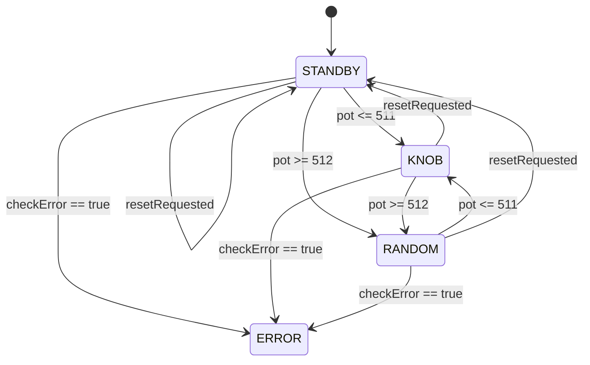

# Arduinoコード設計書（Pitch Trainer）

作成日: 2026-05-26  
対象: Arduino UNO R3 / 16x2 LCD / Passive Buzzer / Potentiometer / Button

## 1. 目的

- C4〜B4（12音）を使って音感トレーニングを行う。
- つまみ左半分で音階選択、右半分でランダム出題を行う。
- シリアルとLCDに音名・周波数・モードを表示する。

## 2. ハードウェアI/O設計

| デバイス | ピン | 用途 |
|:--|:--|:--|
| Potentiometer | A0 | つまみ入力（0〜1023） |
| Button | D2 (INPUT_PULLUP) | 押下イベント（デバウンスあり） |
| Buzzer | D6 | 音出力 |
| LCD RS | D7 | LCD制御 |
| LCD E | D8 | LCD制御 |
| LCD DB4 | D9 | LCDデータ |
| LCD DB5 | D10 | LCDデータ |
| LCD DB6 | D11 | LCDデータ |
| LCD DB7 | D12 | LCDデータ |

制約:
- D0/D1（Serial）は使用しない。
- LCDとBuzzerのピン競合を避けるためBuzzerはD6固定。

## 3. ソフトウェア構成

### 3.1 状態定義

- STATE_STANDBY: 待機状態
- STATE_KNOB_FREQUENCY: つまみ左半分で音階出力
- STATE_RANDOM_OUTPUT: つまみ右半分でランダム出題
- STATE_ERROR: エラー状態（出力停止）

### 3.2 状態遷移



備考:
- RANDOM中のボタン押下は「次の問題要求（nextRandomRequested）」として扱う。
- KNOB/STANDBY中のボタン押下はリセット要求として扱う。

## 4. データ設計

### 4.1 主要テーブル

- NOTE_NAMES[12]: C4, C#4, ..., B4
- NOTE_FREQS[12]: 261.63Hz〜493.88Hz

### 4.2 主要変数

- currentState: 現在状態
- potentiometerValue: つまみ入力値
- currentNoteIndex: 現在の音階インデックス
- frequency: 現在周波数
- nextRandomRequested: ランダム次問要求フラグ
- randomPlaybackInProgress: ランダム出題実行中フラグ
- historyBuffer[5]: 直近5問履歴

## 5. タイミング設計（すべて非ブロッキング）

- センサー更新周期: 100ms（SENSOR_UPDATE_INTERVAL_MS）
- ボタンデバウンス: 50ms（DEBOUNCE_DELAY_MS）
- KNOB再描画・再発音周期: 200ms（KNOB_TONE_REFRESH_MS）
- RANDOM出題: 発音800ms + 無音200ms

設計方針:
- delay() は使用しない。
- millis()差分比較で周期処理を制御する。

## 6. 関数インターフェース設計

| 関数名 | 役割 | 入力 | 出力 |
|:--|:--|:--|:--|
| setup | 初期化 | なし | なし |
| loop | 状態駆動ループ | なし | なし |
| readPotentiometer | A0読取り | なし | int |
| convertKnobToFrequency | つまみ値→周波数変換 | int | float |
| selectRandomNote | 0〜11ランダム選択 | なし | int |
| calcFrequency | index→周波数 | int | float |
| getNoteName | index→音名 | int | const char* |
| playTone | ブザー発音 | float | なし |
| checkError | 入力異常判定 | なし | bool |
| doPlayKnobFrequency | KNOBモード処理 | なし | なし |
| doPlayRandomNote | RANDOMモード処理 | なし | なし |
| doSerialDisplay | Serial/LCD表示 | int, float | なし |
| doShowHistory | 履歴表示 | なし | なし |
| updateButtonDebounce | デバウンス | unsigned long | なし |
| enterErrorState | エラー遷移 | const char* | なし |
| updateLcdMode | モード表示更新 | const char* | なし |

## 7. 処理フロー（擬似コード）

```text
loop:
  now = millis()
  updateButtonDebounce(now)

  if buttonPressedEvent:
    if currentState == RANDOM:
      nextRandomRequested = true
    else:
      resetRequested = true

  if resetRequested:
    stop buzzer
    currentState = STANDBY
    clear runtime flags

  every 100ms:
    potentiometerValue = readPotentiometer()
    if checkError(): enterErrorState()

  if currentState == ERROR:
    stop buzzer
    return

  switch currentState:
    STANDBY:
      if pot <= 511: currentState = KNOB
      else: currentState = RANDOM; nextRandomRequested = true

    KNOB:
      if pot > 511: currentState = RANDOM
      else: doPlayKnobFrequency()

    RANDOM:
      if pot <= 511: currentState = KNOB
      else: doPlayRandomNote()
```

## 8. 異常系設計

- potentiometerValue < 0 または > 1023: ERROR遷移
- potentiometerValue が 0 または 1023: 要件上の異常値としてERROR遷移
- 不正状態値（default分岐）: ERROR遷移

ERROR時の動作:
- Buzzer停止
- Serialにエラー理由表示
- LCDにERROR表示

## 9. 検証観点

- 左半分（0〜511）で12音が切替わる
- 右半分（512〜1023）でボタン押下ごとに次問へ進む
- RANDOM出題の 800ms音 + 200ms無音 が守られる
- LCD配線（RS=D7, E=D8, DB4-DB7=D9-D12）で表示が安定する
- 履歴5件が正しく循環する

## 10. 将来拡張

- スコアリング機能（回答入力付き）
- 出題モード追加（昇順・反復回避・難易度）
- ERROR復帰を長押し条件に変更
